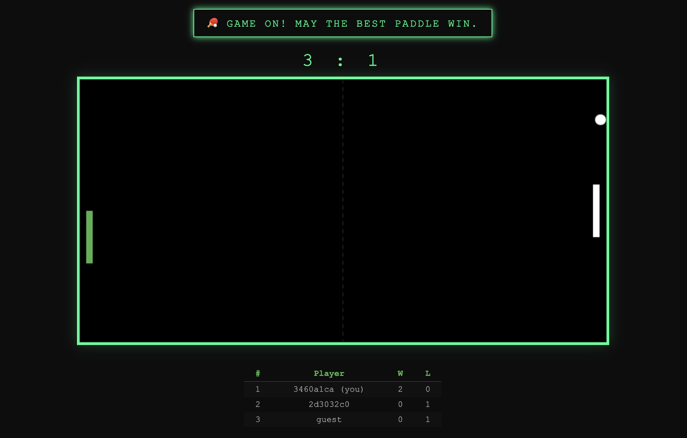

# Pear Pong 🏓

A peer-to-peer Pong game built on [Pear Runtime](https://docs.pears.com/) — no servers, no APIs, just two players connected directly over the P2P network.



## What is this?

Pear Pong is a classic Pong game that runs entirely peer-to-peer using Holepunch's Pear platform. Players discover each other via [Hyperswarm](https://docs.pears.com/building-blocks/hyperswarm), exchange game state directly over encrypted connections, and persist match history using [Hypercore](https://docs.pears.com/building-blocks/hypercore) append-only logs.

**Key P2P concepts demonstrated:**
- Peer discovery via Hyperswarm topic joining
- Real-time state synchronization (host/guest authority model)
- Append-only leaderboard with Hypercore
- Zero infrastructure — no servers, no databases

## Quick Start

### Prerequisites
Both players need [Pear Runtime](https://docs.pears.com/) installed. The quickest way:
```bash
npx pear
```
Then follow the prompt to complete setup.

### Player 1 — start the game
```bash
pear run pear://krx4hk66o69wt13cbythmw44oasyiny1tj4kkputhfaq1j95nh6o
```
A window opens showing "Searching for opponent...". That's it — you're waiting for Player 2.

### Player 2 — join from any machine
On a different computer (or a second terminal on the same machine), run the exact same command:
```bash
pear run pear://krx4hk66o69wt13cbythmw44oasyiny1tj4kkputhfaq1j95nh6o
```
Both players auto-discover each other via Hyperswarm — no IP addresses, no server, no room codes. Roles (left/right paddle) are assigned automatically.

### Run from source (development)
```bash
git clone https://github.com/hakierka/pear-pong.git
cd pear-pong
npm install
pear run -d .
```
For local testing with two instances, use `--tmp-store` for the second player:
```bash
pear run -d --tmp-store .
```

### What if more than 2 people join?
The game is strictly 1v1. Each instance accepts only one peer connection. If a third player tries to connect, they'll stay on "Searching for opponent..." until one of the current players disconnects.

## How It Works

When two instances connect via Hyperswarm, roles are assigned deterministically (by comparing public keys):

- **Host** (left paddle) — runs ball physics, collision detection, and scoring. Broadcasts the full game state ~60 times per second.
- **Guest** (right paddle) — sends paddle position to the host. Receives and renders the authoritative state.

This "host-authority" model is the simplest correct approach for real-time P2P games. It avoids conflicts at the cost of the guest seeing ~1 network round-trip of latency.

## Controls
- **Your paddle:** W (up) / S (down)
- **Serve:** Space

Your paddle is highlighted in green. Both players use the same keys.

## Tech Stack
- [Pear Runtime](https://docs.pears.com/) — P2P desktop app platform
- [pear-electron](https://docs.pears.com/) — Desktop UI shell
- [Hyperswarm](https://docs.pears.com/building-blocks/hyperswarm) — Peer discovery & connections
- Plain JavaScript + HTML Canvas

## Project Structure
```
pear-pong/
├── index.js       # Pear electron bootstrap
├── index.html     # Game UI shell
├── app.js         # Game engine + P2P networking
├── package.json   # Pear config + dependencies
└── test/          # Tests
```

## License
MIT
